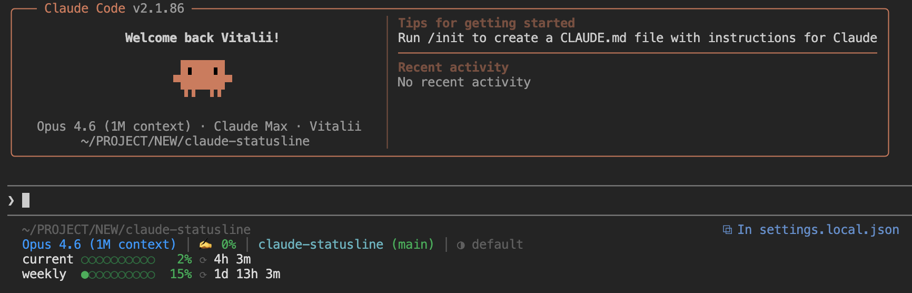

# Claude Code Statusline

> Rate limits, context window, git branch, session time - all in the Claude Code terminal.

[](https://www.npmjs.com/package/@t34-dev/claude-statusline)
[](LICENSE)

A pure-bash status bar for [Claude Code](https://docs.anthropic.com/en/docs/claude-code) (Anthropic's AI coding assistant). Shows rate limit countdowns, context window fill, git branch, session duration, current model, and CLI version. Single `.sh` file, no build step, no binaries. Works on macOS, Linux, and Windows.



## What it shows

- Model name (Opus 4.6, Sonnet 4.5, Haiku, etc.) and Claude Code CLI version
- Context window usage as a percentage, color-coded green to red
- Git branch with a `*` when you have uncommitted changes
- Session timer
- Current effort level (low / medium / high / default)
- 5-hour and 7-day rate limit bars with percentage and countdown to reset
- Extra usage spending if enabled (dollars spent vs. monthly cap)
- Working directory path
- Stale data warning when cached rate limits are old

## Why this one

The whole statusline is one `.sh` file. No compiled binaries, no Rust toolchain, nothing opaque. You can read every line and change whatever you want.

Runs inline through bash and `jq`. API calls are cached for 5 minutes. After a rate limit resets, caching drops to 60 seconds so you see the update faster.

OAuth token discovery works without any setup on your part. The script checks macOS Keychain, Linux `secret-tool`, `~/.claude/.credentials.json`, and the `CLAUDE_CODE_OAUTH_TOKEN` env var, in that order.

The installer backs up your existing statusline config before touching anything. Uninstall puts it back.

## Install

```bash
npx @t34-dev/claude-statusline
```

Checks for dependencies (`jq`, `curl`, `git`), drops the script into `~/.claude/statusline.sh`, updates `~/.claude/settings.json`. Restart Claude Code after installing.

### Uninstall

```bash
npx @t34-dev/claude-statusline --uninstall
```

Restores your previous statusline if one was backed up.

## Layout

```
~/projects/my-app
Opus 4.6 (1M context) v2.1.91 │ ✍️ 3% │ main* │ ⏱ 1h 54m │ ● high
current ●●○○○○○○○○   9% ⟳ 1h 54m
weekly  ●●●○○○○○○○  36% ⟳ 2d 12h 54m
```

Top line is the working directory. Then model info, CLI version, context %, git branch, session time, and effort level. Below that, 5-hour and 7-day rate limit bars with reset countdowns. If extra usage is enabled, a fourth line shows dollars spent vs. the monthly limit.

### Colors

| Usage | Color |
|-------|-------|
| 0-49% | Green |
| 50-69% | Orange |
| 70-89% | Yellow |
| 90-100% | Red |

Same scale for context percentage and rate limit bars.

## Requirements

`jq`, `curl`, and `git`.

macOS:
```bash
brew install jq
```

Ubuntu / Debian:
```bash
sudo apt install jq curl git
```

Windows (Git Bash):
```bash
choco install jq curl git
```

Or with [scoop](https://scoop.sh/):
```bash
scoop install jq curl git
```

## Platform support

| Platform | Shell | Status |
|----------|-------|--------|
| macOS | zsh, bash | Works |
| Linux | bash, zsh | Works |
| Windows | Git Bash | Works |
| Windows | WSL | Works |

BSD vs GNU differences in `date` and `stat` are handled automatically.

## How it works

Claude Code pipes JSON into the statusline script on each refresh. The script pulls model name, context window stats, and session data out of that JSON with `jq`. Rate limits come from the Anthropic OAuth usage API. The response is cached, and when a reset timestamp passes, the cache interval shortens so the display catches up quickly.

About 380 lines of bash total. Nothing phones home. Cache goes to `/tmp/claude/`, the script itself lives in `~/.claude/`.

## Customization

The script is at `~/.claude/statusline.sh`. Change colors, layout, refresh intervals - whatever you need.

Settings entry in `~/.claude/settings.json`:

```json
{
  "statusLine": {
    "type": "command",
    "command": "bash ~/.claude/statusline.sh"
  }
}
```

## Credits

Started from [kamranahmedse/claude-statusline](https://github.com/kamranahmedse/claude-statusline). Added rate limit countdowns, CLI version, working directory, extra usage tracking, effort level, smart caching, and cross-platform support.

## License

MIT
